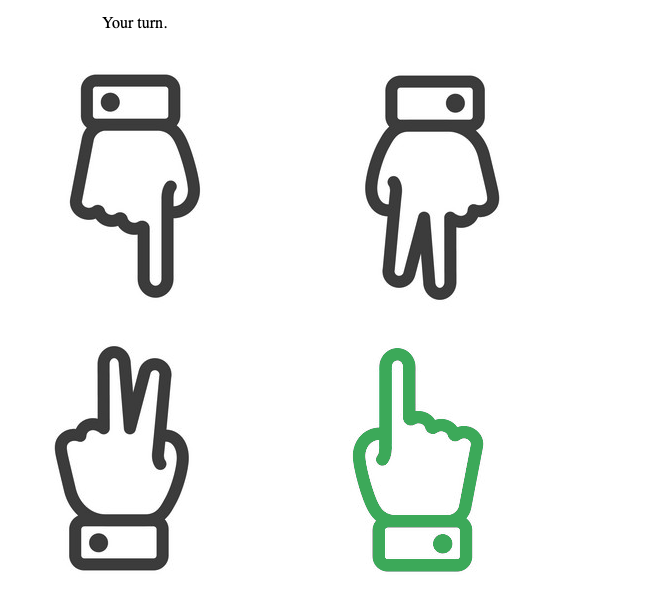

# chopsticks
Interactive web-based [Chopsticks](https://en.wikipedia.org/wiki/Chopsticks_(hand_game)) hand game against an AI opponent.
The backend and AI solver are written in Go, and the frontend is in vanilla ES6. Undertaken as a fun way to teach myself GoLang.

